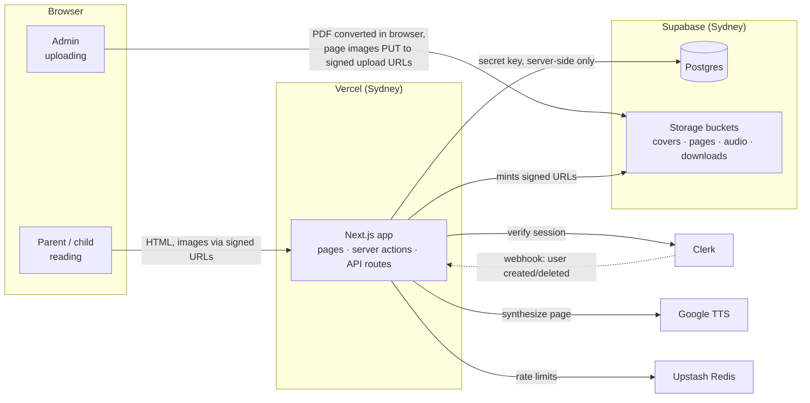

# Books by Tama — Architecture

How the site is put together, which service holds what, and what happens behind the scenes when a book is uploaded, narrated and read. Companion to `CLAUDE.md` (developer conventions) and `BACKLOG.md` (what's next).

## 1. The services

| Service | What it does for us | Plan | Where to look |
|---|---|---|---|
| **Vercel** | Runs the Next.js site (pages, server actions, API routes). Functions run in **Sydney** (`vercel.json`) next to the database. Deploys automatically on every push to `main`. | Hobby (free) | vercel.com → project → Deployments / Settings → Environment Variables |
| **GitHub** `booksbytama/tama-website` | Source code. `main` is production. | Free | — |
| **Supabase** (Sydney) | **Postgres database** (books, pages, users, profiles, shelves, downloads, pronunciations) and **Storage** (covers, page images, narration audio, starter-pack PDFs). | Free: 500 MB DB · 1 GB storage · 5 GB/month bandwidth | supabase.com → project → Table Editor / Storage |
| **Clerk** | Sign-up / sign-in for parents, teachers, reviewers. Holds passwords and Google login; we never see credentials. | Dev instance (free) — upgrade to a production instance before marketing | clerk.com → Users (set `role: admin` in a user's Public metadata) |
| **Google Cloud Text-to-Speech** | Turns each page's words into an MP3 with per-word timings (the read-aloud voice). | Free: 1 M characters/month (a book ≈ 3 k) | console.cloud.google.com → APIs & Services → Credentials |
| **Upstash Redis** | Rate limiting (reader opens, profile creation, downloads, admin actions). If unset, limits are simply off. | Free | upstash.com |

Nothing else is paid or has a card attached except Google Cloud (required to enable the API; usage stays inside the free tier).

## 2. The big picture



**One rule explains most of the design: the browser never talks to Supabase with a key.** Every database read and write happens in Next.js on the server using the Supabase *secret* key (`SUPABASE_SECRET_KEY`). Row-Level Security is switched on with no public policies, so even if someone found the project URL they could read nothing. Files in private buckets are only reachable through short-lived **signed URLs** the server hands out per request.

## 3. Where everything is stored

### Database tables (Supabase → Table Editor)

| Table | One row per | Notable columns |
|---|---|---|
| `series` | series (Starfish Super Squad, colouring series) | `slug`, `name`, `sort_order` |
| `books` | book | `slug` (URL), `title`, descriptions, `book_type` (picture/colouring), `cover_path`, `page_count`, `preview_pages` (free sample length), `is_listed` (public or draft), `sample_enabled`, `member_reading_enabled` (whole book free for signed-in members), `read_aloud_enabled`, `narration_voice`, `buy_links` (JSON list) |
| `book_pages` | page of a book | `page_number`, `storage_path` (image in `pages` bucket), `width`/`height`, `text`, `words` (JSON: each word + its box on the page as % of width/height), `audio_path` (MP3 in `audio` bucket), `timings` (JSON: start second of each word) |
| `users` | signed-up person | `clerk_id` (link to Clerk), `email`, `role` (parent/admin), `is_reviewer` |
| `profiles` | child (or grown-up) reader under a user | `name`, `age`, `colour`, `is_grown_up` |
| `shelf_items` | a book a profile has opened | `last_page` |
| `subscriptions` | (empty for now) | ready for Stripe later |
| `downloads` | starter-pack file | `slug`, `title`, `storage_path` (PDF in `downloads` bucket), `is_listed` |
| `pronunciations` | word the narrator gets wrong | `word` → `say_as` (sounds-like or `/IPA/`) |
| `_migrations` | applied SQL file | bookkeeping for `npm run db:migrate` |

Schema changes live as numbered files in `supabase/migrations/` and are applied with `npm run db:migrate` (uses `DATABASE_URL`, local only).

### Storage buckets (Supabase → Storage)

| Bucket | Public? | Contents | Path pattern |
|---|---|---|---|
| `covers` | **public** | book cover images | `<slug>.jpg` or `<bookId>-<stamp>.jpg` |
| `pages` | private | one WebP per page, ~1600 px wide, ~120 KB | `<bookId>/<batch>/<001>.webp` |
| `audio` | private | one MP3 per narrated page; voice previews | `<bookId>/<voice>/<001>-<stamp>.mp3`, `previews/<voice>.mp3` |
| `downloads` | private | starter-pack PDFs | `<stamp>-<filename>.pdf` |

**The original PDF is never stored anywhere.** It is opened in the admin's browser, converted there, and discarded.

Rough sizes: a 36-page book ≈ 4.3 MB of page images + ≈ 2 MB of audio. The 1 GB free tier holds well over 100 books; the 5 GB/month bandwidth allows roughly 40 000 page views a month.

### Code (GitHub)

```
app/(marketing)/   public site + /account/*     components/site/     header, footer, tab bar
app/(auth)/        Clerk sign-in / sign-up       components/books/    cards, buy links, read CTA
app/read/[slug]/   full-screen reader            components/reader/   BookReader (curl, zoom, read-aloud)
app/admin/         admin area + server actions   components/admin/    uploader, narration, forms
app/api/           Clerk webhook, downloads      lib/db/              all database queries
supabase/migrations/  schema                     lib/tts.ts           Google TTS + pronunciations
scripts/           migrate, seed, backfill,      lib/pdf-words.ts     PDF text → word boxes
                   narrate-book                  lib/auth.ts          who is signed in / admin / reviewer
```

## 4. What happens behind the scenes

### Uploading a book (Admin → book → Choose PDF)

1. The browser opens the PDF with **pdf.js** — no upload of the PDF itself.
2. For each page it (a) renders the page to a canvas and encodes it as **WebP** (~1600 px), and (b) reads the page's **text with positions**, gluing back words the PDF export split in two and computing a box for every word as a percentage of the page.
3. The server action `beginPageUploadAction` mints one **signed upload URL** per page; the browser PUTs each WebP straight into the `pages` bucket (never through Vercel, so no function size/time limits).
4. `finishPageUploadAction` replaces the book's `book_pages` rows (image path, size, text, word boxes), updates `page_count`, deletes the old images and audio, and switches `read_aloud_enabled` off because any narration is now stale.
5. The uploader reports "Words found on N of M pages". Pages without text are picture-only (cover, blanks, art spreads).

### Generating the voice (Admin → book → Read aloud → Generate)

1. You pick a narrator; ▶ plays a cached preview line from the `audio` bucket (generated once per voice).
2. The admin page loops over the text pages **one at a time** calling `narratePageAction` (so a long book never hits a function timeout, and you see progress). Each call:
   - loads the page's words and the **pronunciation dictionary**;
   - builds SSML: a `<mark>` before every word (so Google reports when each word starts), a `<break>` after sentences and commas, and `<sub>`/`<phoneme>` substitutions for dictionary words;
   - calls Google TTS with an **en-AU Neural2** voice (the newer Chirp voices sound better but return no word timings, so they can't drive highlighting);
   - stores the MP3 in `audio/`, and `timings` (one start-second per word) on the page row.
3. Failed pages are retried; when done, `read_aloud_enabled` is switched on. "Regenerate pages" lets you redo just the pages a dictionary fix affects.

`scripts/narrate-book.mts <slug> <voice> [pages]` does the same from the command line; `scripts/backfill-words.mjs <slug> <pdf>` fills word boxes for a book uploaded before read-aloud existed.

### Reading (any visitor → Read sample / Read the whole book)

1. `/read/[slug]` runs on the server (Sydney): it checks the Clerk session, works out **how many pages this person may see** — the free sample for guests; the whole book if it's flagged free for members and they're signed in; everything if they're an admin or reviewer — and applies the rate limit.
2. It mints **signed URLs** (1 hour) for exactly those page images and, if narration is on, their MP3s, and hands them plus the word boxes and timings to the `BookReader` component. Nothing about pages beyond the limit reaches the browser.
3. In the browser, `BookReader` shows facing pages on wide screens and single pages on phones, turns them with a 3D curl (tap, swipe, arrows, drag-the-corner), pre-decodes nearby pages so turns are instant, supports pinch/double-tap zoom, and saves progress to the active child profile's shelf.
4. **Read to me** fetches the page's MP3 and plays it through the **Web Audio API** (the first tap unlocks it; iOS then allows auto-turned pages to keep playing). Each animation frame it compares the playback clock to `timings` and lights the matching word's box on the artwork. At the end of a page it turns and continues (Auto-turn) or stops.
5. At the last allowed page the end card offers the paperback links, and for guests on a member-free book, "Join free & read the whole book".

### Accounts, profiles, reviewers

- **Clerk** owns the login. On a signed-in person's first request, `ensureUser()` creates their row in `users` (the Clerk webhook also syncs create/delete, but isn't required).
- **Admin** = Clerk user with Public metadata `{"role": "admin"}`. **Reviewer** = `is_reviewer` ticked in Admin → Members; reviewers read every book in full, drafts included, forever.
- **Children never log in.** They are `profiles` under a parent; the active profile is remembered in a cookie and used to save shelf progress.

### Caching and speed

- Home, books, colouring, buy and each book page are **statically cached** at the edge (5-minute refresh, and refreshed immediately when you save in admin). That is why login state on those pages is rendered in the browser.
- The reader, account and admin pages are always rendered per request.
- Vercel functions and Supabase are both in Sydney; before that, each database round-trip from the US cost ~250 ms.

## 5. Environment variables

| Variable | Where used | Notes |
|---|---|---|
| `NEXT_PUBLIC_APP_URL` | metadata, redirects | `https://booksbytama.com` (scheme optional) |
| `NEXT_PUBLIC_SUPABASE_URL` | server | project URL |
| `SUPABASE_SECRET_KEY` | **server only** | `sb_secret_…` (replacement for the legacy service_role key) |
| `DATABASE_URL` | local only | migrations; not needed on Vercel |
| `NEXT_PUBLIC_CLERK_PUBLISHABLE_KEY`, `CLERK_SECRET_KEY` | auth | swap for production-instance keys when Clerk is upgraded |
| `CLERK_WEBHOOK_SECRET` | `/api/webhooks/clerk` | optional locally |
| `GOOGLE_TTS_API_KEY` | narration | restricted to the Text-to-Speech API |
| `UPSTASH_REDIS_REST_URL`, `UPSTASH_REDIS_REST_TOKEN` | rate limits | optional |

Sign-in paths and post-login redirects are set in code (`app/layout.tsx`), not env.

## 6. Everyday operations

| Task | How |
|---|---|
| Publish a new book | Admin → New book → fill Details → Upload cover → Choose PDF → Read aloud → Generate → tick **Listed on site** → Save |
| Let friends review a draft | Leave **Listed** unticked; Admin → Members → **Make reviewer** on their account |
| Fix a mispronounced word | Admin → Pronunciations → add word → **Where used?** → in that book, **Regenerate pages** |
| Change the free-sample length | Admin → book → Details → Free sample length |
| Make a book free for members | Admin → book → Details → **Whole book free for signed-in members** (the landing page picks this up automatically) |
| Add starter-pack files | Admin → Starter pack |
| Change the schema | add `supabase/migrations/000N_name.sql`, run `npm run db:migrate` locally |
| Deploy | push to `main`; Vercel builds. Env var changes need a manual **Redeploy** |
| Local development | `npm run dev` (never run `npm run build` while it's running — they share the `.next` folder) |

## 7. Known limits and what's next

- Slow read-aloud lowers the pitch slightly (it slows the audio). A second slow recording per page would fix it cheaply.
- Word boxes are estimated from each line's extent, so highlights can drift a few pixels on long lines.
- Clerk is a development instance: fine for testing, upgrade before promoting the site.
- Subscriptions (Stripe) are designed for but not built; `subscriptions` table and the `isMember` check are the hooks.
- See `BACKLOG.md` for everything else.
